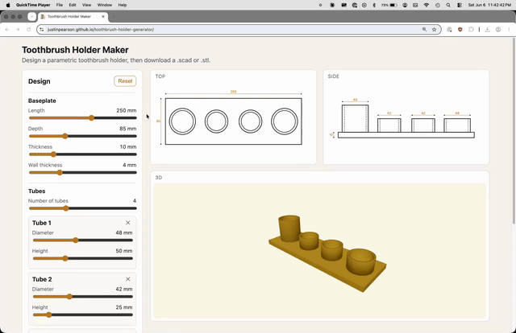
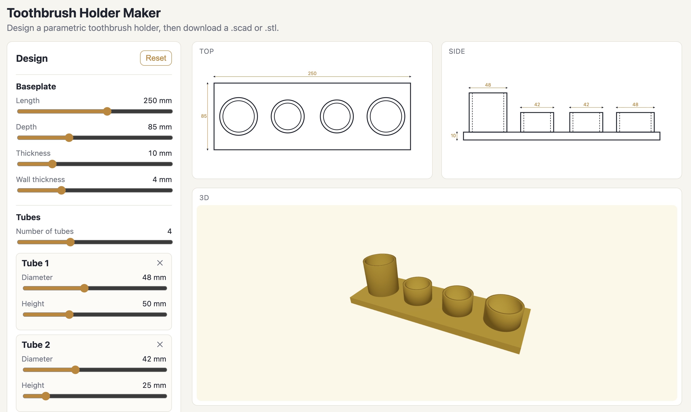
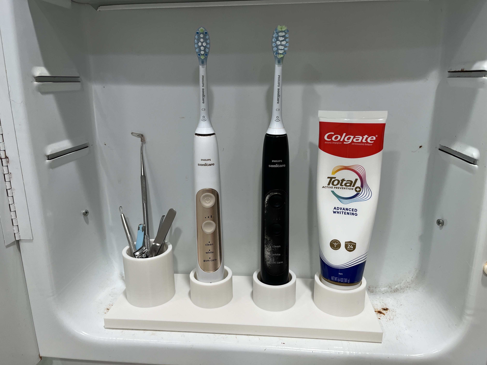

# Toothbrush Holder Generator

An app to make a holder for your toothbrush, that you can 3D print.

**Live app: https://justinpearson.github.io/toothbrush-holder-generator/**

[](images/demo.mp4)

_Click the demo above to watch the full-quality video ([`images/demo.mp4`](images/demo.mp4))._





## For A.I.

A web app for designing a parametric toothbrush holder. Move sliders to set the
baseplate size and, for each object, its **shape** (circle, ellipse, polygon, or star),
whether it's a **solid** post or a **hollow tube**, and its diameter / height / wall —
either from **global defaults** or overridden per object. Watch the top, side, and 3D
views update live, preview different filament colors, then download an OpenSCAD `.scad`
file and a ready-to-print binary `.stl`.

It grew out of a one-off model (`toothbrush-holder-3d-model/`) that was hand-drawn,
turned into a `.scad`, rendered to `.stl` with OpenSCAD, and printed on a Bambu P1S.
This app lets anyone produce that kind of holder — and more — without writing OpenSCAD.

## How it works

The holder is a baseplate (`cube`) plus N objects, each extruded from a 2D cross-section
outline that is evenly spaced along the length and centered in depth. A **solid** object
is a filled prism; a **tube** is a solid base slab plus a holed upper ring, so the bore
is **blind** (it stops one wall above the base and does not drain through).

The single source of truth is `src/geometry/crossSection.ts`, which produces the outline
points (and the inset inner outline for tubes) for every shape. Those exact points feed
all three consumers, so they can't drift apart:

- **Views.** Top and side are SVG (polygons from the outline points); the 3D view is
  Three.js via `@react-three/fiber`, with each object an `ExtrudeGeometry`. See
  `src/components/three/` and `src/components/views/`.
- **`.scad` export.** Each object is emitted as `polygon(points=[...])` (the same points)
  wrapped in `linear_extrude`, solids and tubes via small generic modules. See
  `src/export/scadGenerator.ts`.
- **`.stl` export.** The same outlines are extruded and merged into a single Z-up
  (printer/OpenSCAD convention) binary STL via Three's `STLExporter`. See
  `src/geometry/buildSceneGeometry.ts` and `src/export/stlGenerator.ts`.

The inner (bore) outline is inset from the outer outline by the wall thickness — exact
for circle/ellipse/regular-polygon, approximate for stars. Objects overlap the baseplate
as separate solids rather than a CSG union; every slicer treats overlapping closed solids
as filled, so the STL prints correctly. `yarn verify:stl` cross-checks our STL against
OpenSCAD's for a model containing all four shapes (see below).

## Develop

```sh
yarn install
yarn dev            # http://localhost:5173
```

## Test

```sh
yarn test           # Vitest unit tests (model, scad/stl, geometry)
yarn build          # typecheck + production build
yarn exec playwright test -- --project=chromium --workers=1 --no-deps   # e2e
```

## Verify STL against OpenSCAD

`yarn verify:stl` cross-checks the in-browser STL against the STL OpenSCAD produces from
the generated `.scad`, for the default model. It compares triangle counts, bounding boxes,
and signed volumes, and renders both STLs to PNG (via OpenSCAD `import()`) with an
identical camera so they can be eyeballed. Output goes to `verify-output/`.

It expects OpenSCAD at `/Applications/OpenSCAD.app/Contents/MacOS/OpenSCAD`. The bounding
boxes match exactly; our reported volume reads a few percent higher because our STL is
overlapping solids (the tube/base overlap is counted twice, plus a small print epsilon),
whereas OpenSCAD reports the true evaluated union — both print identically.

## Build for static hosting

```sh
yarn build          # outputs dist/ (base is relative, so it works on any subpath)
```

`dist/` is a static site — host it on GitHub Pages, Netlify, Vercel, or any static host.

### GitHub Pages

This repo deploys to GitHub Pages via `.github/workflows/deploy.yml`: every push to
`main` builds the app and publishes `dist/`. For it to run, set the repository's
**Settings → Pages → Source** to **GitHub Actions** (not "Deploy from a branch" — a
branch/root deploy can't build the Vite app). The site is then served at
`https://<user>.github.io/toothbrush-holder-generator/`.

## Project layout

```
src/
  model/        types, defaults, resolve (override?? global), derive, validation
  geometry/     crossSection (outlines), buildObjectGeometry, buildSceneGeometry
  export/       .scad generator, .stl generator, download helper
  state/        useHolderParams hook (single source of truth)
  components/   ParameterControls (globals + per-object cards), views (Top/Side/3D),
                three/ (ExtrudeGeometry meshes), FilamentPicker, DownloadBar
scripts/        verify-stl.ts  (OpenSCAD cross-check, all four shapes)
e2e/            Playwright specs
```

## Limitations / future work

- Holes are always blind (bores stop one wall above the base); the blind floor is one
  wall thick.
- The star bore is an approximate inward inset (exact uniform wall for
  circle/ellipse/regular-polygon).
- The STL is overlapping solids, not a CSG-evaluated union (fine for slicing). A true
  manifold could be produced later with a CSG library if needed.
- Objects are evenly spaced and centered in depth; there's no manual per-object
  positioning or rotation yet.
